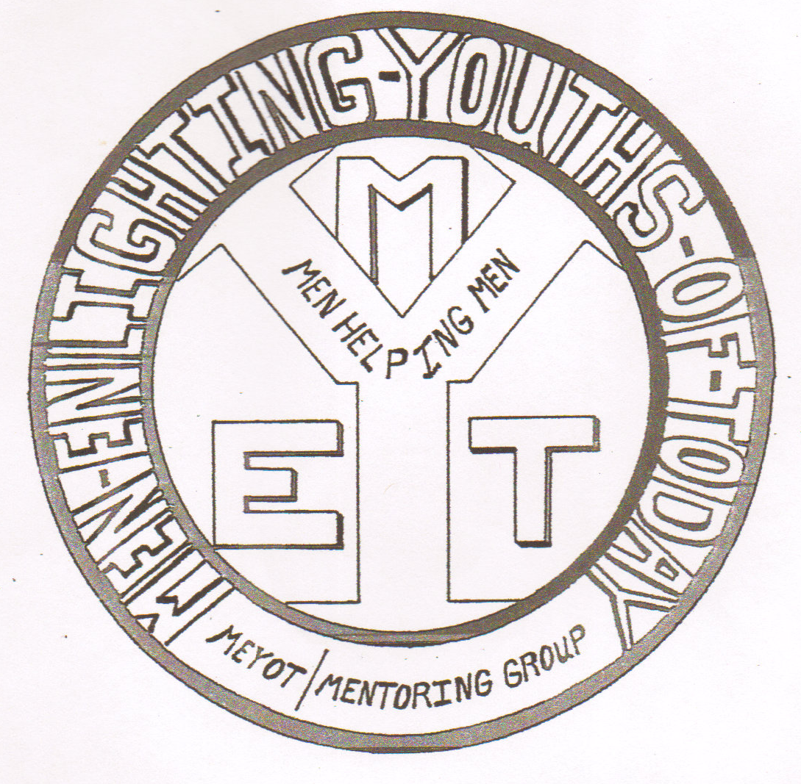

- [How to Help](help.html)
- [For Clients](clients.html)
- [Contact](contact.html)

# Meyot
**A Mind, Body, and Spirit working in Harmony is Capable of Unlimited Possibilites!**

**Men (women) Enlighting the Youth of Today**  

**_Helping People Help Themselves!_**

## Mission Statement

>To create an atmosphere conducive for changing the thought patterns of an individual; thereby producing positive behavior.  To create a positive mental attitude within an individual who is having a difficult time transitioning from prison. Rescind the ptterns of recidivism.

[Recidivism](http://www.nij.gov/topics/corrections/recidivism/Pages/welcome.aspx)
 
 ### Vision

 >The vision of M.E.Y.O.T is to create an environment where the atmosphere will be conducive for changing the thought patterns of participants involved in the program, thereby producing psitive behaviors. Meyot will help guide and encourage individuals transitioning from prison society. Meyot will keep it's participants motivated to move beyond their past and into their future, through various concepts designed to help the individual in pursuit of reaching their full potential.
 
#### Objective

>We as a society are always looking to restore thing and sometimes those things have yet to be built. The objetcive of Meyot is to help facilitate a positive self-image and a winning attitude within the individuals who participate in the program. By helpng participants learn job skills, become aware of their spiritual essence and help them learn what it is they can do within Meyot will help its participants deal with emotional, socail, physical, and mental anxiety that come from the doubts when making a life altering choice or decision.
